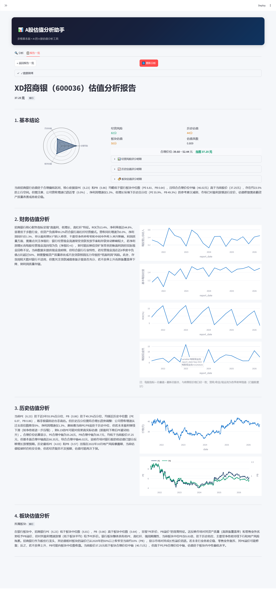

# Robo Advisor — A股估值分析 AI Agent

多维基本面 + AI 的 A 股估值分析工具。  
输入股票代码，自动生成 4 维度估值分析报告。

<p align="center">
  
</p>

## 功能

- **基本面估值** — ROE、毛利率、净利率、现金流质量、存货周转等核心财务指标
- **历史估值** — 近 5 年 PE/PB 百分位 + 增长调整后的合理价位区间
- **基本面（GGM）** — 基于 Gordon Growth Model 的合理 PE 估算，含风险乘数调整
- **板块估值** — 申万行业分类 PE/PB 对比，个股在板块中的相对位置
- **综合评分雷达图** — 经营风险、历史估值、板块估值三维度评分
- **多 LLM 支持** — DeepSeek / OpenAI / Qwen / Ollama 可切换
- **报告历史** — 分析结果存入 SQLite，支持历史回顾

## 快速开始

### 前置要求

- Python >= 3.11
- 至少一个 LLM API Key（推荐 DeepSeek）

### 安装

```bash
git clone https://github.com/your-username/robo-advisor.git
cd robo-advisor
python -m venv .venv

# Windows
.venv\Scripts\activate
# macOS / Linux
source .venv/bin/activate

pip install -e .
```

### 配置 LLM

```bash
cp .env.example .env
```

编辑 `.env`，填入 API Key：

```ini
LLM_PROVIDER=deepseek
LLM_API_KEY=sk-your-key-here
LLM_MODEL=deepseek-chat
```

### 启动

```bash
# Windows (必须设置 PYTHONNOUSERSITE 避免系统包冲突)
$env:PYTHONNOUSERSITE=1; streamlit run src/app.py --server.port 8501

# macOS / Linux
PYTHONNOUSERSITE=1 streamlit run src/app.py --server.port 8501
```

打开浏览器访问 `http://localhost:8501`。

## 配置项

| 环境变量 | 说明 | 默认值 |
|---|---|---|
| `LLM_PROVIDER` | LLM 供应商: deepseek/openai/qwen/ollama | deepseek |
| `LLM_API_KEY` | API Key | — |
| `LLM_MODEL` | 模型名称 | deepseek-chat |
| `OLLAMA_BASE_URL` | Ollama 地址 | http://localhost:11434/v1 |
| `CACHE_DIR` | 缓存目录 | ./data/cache |

## 数据源

| 数据 | 来源 |
|---|---|
| 实时行情、历史 K 线 | 新浪财经 |
| 财务数据（季度） | 东方财富（`stock_financial_abstract`） |
| 财务数据（年度） | 同花顺（`stock_financial_abstract_ths`） |
| 申万行业分类 | 申万宏源（每日更新） |
| 申万行业估值 PE/PB | 申万指数页面 |

> 东方财富（EM）部分端点已被屏蔽，季度财务数据可能间歇性失败。

## 缓存

- 申万行业分类静态映射文件保存在 `data/cache/`，首次运行自动下载并固化
- 财务数据和行情数据缓存于 `data/cache/cache.db`
- 可删除 `cache.db` 重新缓存，行业映射文件无需重新生成

## 项目结构

```
robo-advisor/
├── src/
│   ├── app.py                  # Streamlit 主入口
│   ├── config.py               # 配置加载
│   ├── agent/
│   │   ├── prompts.py          # LLM 提示词
│   │   └── llm_client.py       # LLM 多供应商客户端
│   ├── analysis/
│   │   ├── historical.py       # 历史百分位、growth trend、价格区间、评分
│   │   ├── financial.py        # 财务指标计算
│   │   └── sector.py           # 申万行业分类 & PE/PB
│   ├── data/
│   │   └── fetcher.py          # 数据获取（AKShare 封装）
│   ├── database/
│   │   ├── models.py           # 数据库连接 & 建表
│   │   ├── cache.py            # 数据缓存读写
│   │   └── report.py           # 报告存储 & 查询
│   └── report/
│       ├── render.py           # Streamlit 报告渲染
│       └── formatter.py        # 文本格式报告
├── data/cache/                 # 离线缓存文件
├── tests/
├── .env.example                # 环境变量模板
├── pyproject.toml
└── README.md
```

## 技术栈

- Python 3.11+
- [Streamlit](https://streamlit.io/) — UI
- [AKShare](https://akshare.akfamily.xyz/) — 金融数据
- [Pandas](https://pandas.pydata.org/) / [NumPy](https://numpy.org/) — 数据处理
- [Plotly](https://plotly.com/python/) — 图表
- [SQLite](https://www.sqlite.org/) — 缓存
- [OpenAI Python SDK](https://github.com/openai/openai-python) — LLM 客户端

## 免责声明

本项目仅供学习和研究使用，**不构成任何投资建议**。  
估值分析基于公开财务数据和统计模型，可能存在误差和延迟。  
股市有风险，投资需谨慎。

## License

MIT
